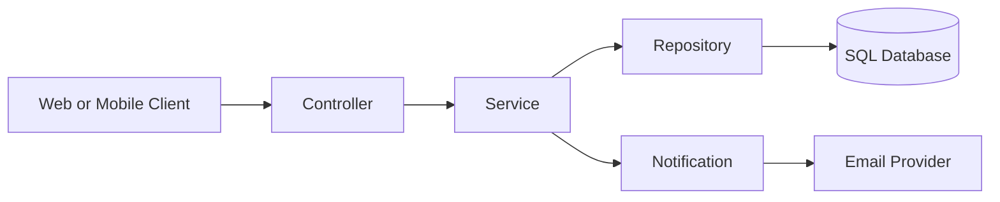
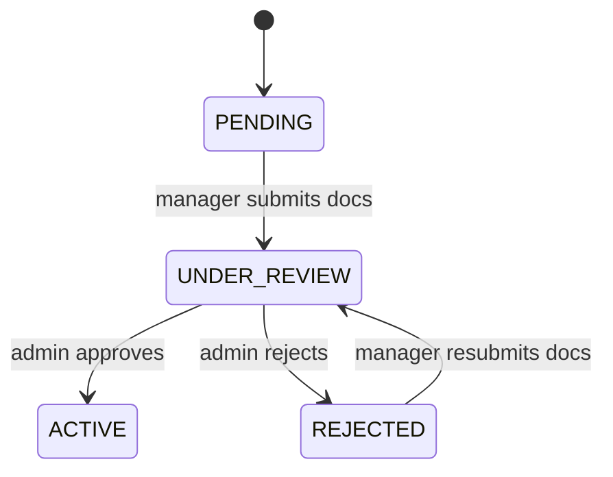

# backend_template

Spring Boot template with environment-first configuration using a local .env file.

## Prerequisites

- Java 21+
- Maven Wrapper included in this repo
- Windows PowerShell or CMD

## 1) Create your local .env file

Use one of the following commands from the project root.

### PowerShell

Copy-Item .env.example .env

### CMD

copy .env.example .env

## 2) Edit your local values

Open .env and update values as needed.

APP_NAME=backend_template
APP_ENV=local
SERVER_PORT=8080
JWT_SECRET=
JWT_EXPIRATION_MS=3600000

## 3) Run the application

### PowerShell

.\mvnw.cmd spring-boot:run

### CMD

mvnw.cmd spring-boot:run

## 4) Enable pre-commit auto-format

Set repository hooks path once so git uses the shared hook.

### PowerShell

git config core.hooksPath .githooks

### CMD

git config core.hooksPath .githooks

After this, every commit will automatically:

- run formatter (`spotless:apply`)
- run lint (`checkstyle:check`)
- re-stage formatted files

## Code quality commands

### PowerShell

.\mvnw.cmd spotless:apply
.\mvnw.cmd spotless:check
.\mvnw.cmd checkstyle:check

### CMD

mvnw.cmd spotless:apply
mvnw.cmd spotless:check
mvnw.cmd checkstyle:check

## How configuration works

- application.properties imports .env if it exists.
- Environment values are read from .env and can be overridden by system environment variables.
- Defaults are applied if values are missing.

Current mapped properties:

- APP_NAME -> spring.application.name
- APP_ENV -> app.environment
- SERVER_PORT -> server.port
- JWT_SECRET -> app.jwt.secret (optional, for JWT auth modules)
- JWT_EXPIRATION_MS -> app.jwt.expiration-ms (optional)

## Workflow

1) Create or update .env and confirm defaults in application.properties.
2) Run the app with the Maven wrapper.
3) Run format and lint checks before commit.
4) Use feature branches and open PRs against the base branch.

## Architecture

- Layered Spring Boot application with feature modules under com.hcl.backend_template.
- Feature packages include booking, facility, hotel, notification, promotion, review, room, and user.
- Shared utilities and cross-cutting concerns live in common.
- Configuration is environment-first via .env and application.properties.

## Layer responsibilities

- Controller: HTTP boundary, request validation, role checks, and DTO mapping.
- Service: business rules, orchestration, transactional boundaries, and policy enforcement.
- Repository: data access and query encapsulation.
- Domain/DTO: entity models and request/response contracts.
- Security: JWT auth, role routing, and request filters.
- Bootstrap: dev-only seeders and data fixtures.

## Core modules

- Auth/User: registration, login, JWT issuance, profile, loyalty.
- Hotel: manager onboarding, hotel details, and status transitions.
- Facilities: global facility catalog and hotel facility mapping.
- Room: room types, inventory, availability, search.
- Booking/Review: reservations, cancellations, review submission.
- Promotion: active promotions and codes.
- Notification: outbound email and alerts.

## Role flows

- Customer: search -> availability -> booking -> confirmation -> review.
- Manager: create hotel -> upload docs -> add rooms -> manage inventory.
- Admin: review docs -> approve or reject -> monitor activity.

## Request lifecycle diagram

## Hotel review state diagram

## Flow summaries by role

### Customer flow

1) Search hotels and room types
2) Check availability and price
3) Book and receive confirmation
4) Leave review after stay

### Manager flow

1) Register and create hotel
2) Upload verification documents
3) Add room types and inventory
4) Maintain hotel details and availability

### Admin flow

1) View pending or under review hotels
2) Approve or reject documents
3) Monitor system activity and promotions

## Proposed plan

- Add API documentation (OpenAPI) and publish a local docs route.
- Harden auth: finalize JWT settings, refresh token flow, and role-based access.
- Expand data model migrations and seed data for local dev.
- Add service-level tests and repository tests for critical flows.
- Improve observability with structured logs and health checks.

## Notes

- .env is ignored by git.
- .env.example is committed as a template.
- CI runs on pull requests and pushes to `main` and `master` via GitHub Actions.
